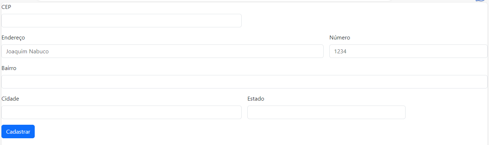

# Índice 

[Projeto - Endereço]  ()
[Descrição]  ()
[Funcionalidades]  ()
[Tecnologias utilizadas]  ()
[Fontes consultadas]  ()
[Autores]  ()

# 👩🏽‍💻 Projeto - Endereço

## 📝 Descrição

Projeto em desenvolvimento na disciplina de Programação Web I,começamos o projeto no dia 20/09/2023 , nesse projeto utilizamos mais uma vez, um, modelo pronto extraído do [BootsTrap](https://getbootstrap.com/docs/5.3/forms/layout/#gutters) será o segundo modelo desta página, irei fazer um passo a passo para facilitar o seu projeto e para ajudar visivelmente.

 Nesse modelo vamos fazer uma página de endereço,apresentado na imagem inicial do projeto, e ao longo do processo fizemos algumas alterações e ainda vamos continuar execuntado algumas alterações, até o projeto ficar plenamente no resultado que pretendemos.

## 🕹️ Funcionalidades

## 🤖 Tecnologias utlizadas

## 💻 Fontes consultafdas

## ✒️ Autores

Hoje fizemos a tradução de algumas palavras, do código que pegamos no Bootstrap, efetuamos algumas alterações do código.(19/09/23)
para o README colocar gifs, links, fotos de como pegamos o modelo no bootstrap e ir ligando caminhos explicando eles. Conforme oq foi feito e conforme oq será feito(ANOTAÇÕES PARA FAZER O README).